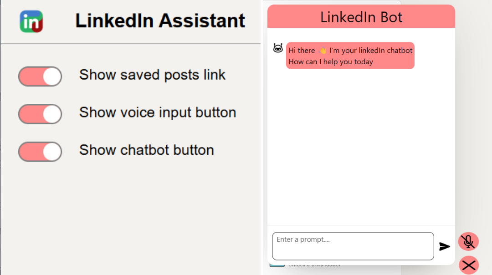

<h1 align="center">🌟 LinkedIn Assistant Chrome Extension🌟</h1>

## A chrome extension for Enhanced LinkedIn Navigation and AI assistance



"Boost your productivity and streamline your LinkedIn experience with LinkedIn Assistant, a Chrome extension that equips you with powerful features directly within the LinkedIn interface.

This extension provides a convenient popup interface for managing three custom UI elements:

- Gemini Powered AI Chatbot Button: Integrate the power of Gemini AI directly into your LinkedIn workflow. With a single click, access a dedicated chatbot window powered by the Gemini API. This eliminates the need to switch between pages, allowing you to leverage AI functionalities seamlessly within LinkedIn.

- Saved Posts Nav Link: Effortlessly access your saved posts with a single click. No more navigating through menus - LinkedIn Assistant adds a dedicated link directly to the LinkedIn navbar, saving you valuable time.

- Voice Input Button: Tired of repetitive clicking? Utilize the voice input button to effortlessly navigate LinkedIn navbar using voice commands. Open specific navbar links with ease, allowing for a hands-free browsing experience.

Benefits:

- Utilize Gemini AI functionalities without leaving LinkedIn.
- Navigate to saved posts with a single click.
- Leverage voice commands for hands-free navigation.

This extension simplifies your LinkedIn experience, enhancing productivity and streamlining your workflow. "

## Installation

1. **Clone the Repository**: Start by cloning this GitHub repository in a folder using the command:

```bash
git clone https://github.com/MuneerHashmat/linkedIn-assistant-extension.git
```

- _Optional_: Open images folder and delete screenshots folder from there

2. **Include Gemini API Key**: On the root of the project create a new JavaScript file `config.js` and add the following code:

```javascript
export const API_KEY = "YOUR_GEMINI_API_KEY";
```

2. **Open chrome extensions**: Open chrome browser and navigate to chrome extensions. You can do it by by clicking on the three-dot menu icon in the top right corner, selecting extensions and then manage extensions.

3. **Turn On Developer Mode**: In the Extensions page, enable Developer Mode by toggling the switch located in the top right corner of the page.

4. **Load Unpacked Extension**: After activating Developer Mode, extra choices will become visible. Proceed by clicking the "Load unpacked" button.

5. **Select Extension Folder**: A file dialog will open. Navigate to the folder where you cloned the GitHub repository, and select the that entire folder.

6. **Confirm Installation**: After selecting the extension folder, Chrome will load the extension, and you should see it listed among your installed extensions.

7. **Verify Extension**: Verify that the extension has been successfully installed by checking for its icon in the Chrome toolbar or extensions menu.

8. **Pin Extension**: If desired, you can pin the extension to the toolbar for easy access. Right-click on the extension icon and select "Pin."

## New things learned:

- **Chrome extension development**: Through this project, I got hands-on experience in developing extensions from chrome. I learned in detail about the architectural of chrome extensions such as service workers, content scripts and popups.

- **Chrome APIs**: In this project I learned about and leveraged chrome APIs for different purposes such as chrome.tabs for manipulating tabs, chrome.storage for storage and chrome.runtime for communication between different components of the extension.

## Challenges faced

- **Limited support for ES6 modules**: Due to limited support for ES6 modules in chrome extension content scripts, I faced difficulties in import and export functionalities.
- **Library and API limitations**: I faced difficulty in using APIs and Javascript libraries due to usage limitations in chrome extensions. I had to manually download and add javascript library files.
- **Difficulty in debugging**: The architecture of chrome extensions is completely different from normal web apps with different components running in different contexts of web browser and pages. That made finding and resolving bugs increasingly difficult.
